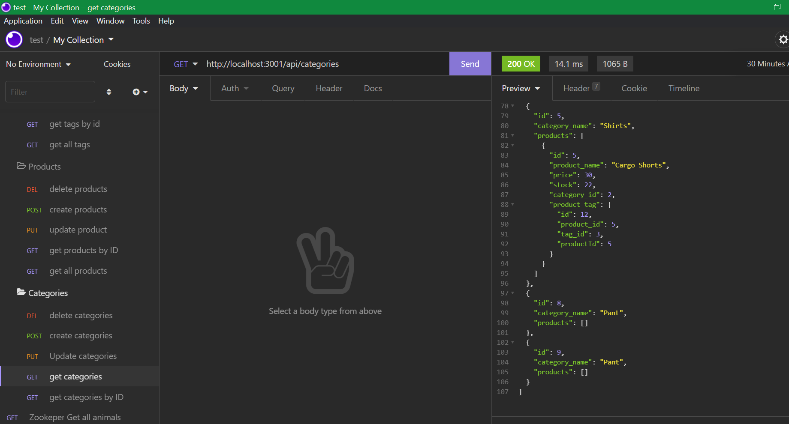

# Ecommerce
Ecommerce application is to run the mysql query and perform the database intialization with the use of sequelize dependency.
## Purpose

With the help of mysql passing the database and generating the database using the sequelize dependency and creating the CRUD application.
## Built With

mysql
javascript
node.js
mysql2
express
dotenv
sequelize

## Github repo link

https://github.com/veeditparikh2211/Ecommerce
## Video

## Application

## Contribution

Made by Veedit Parikh